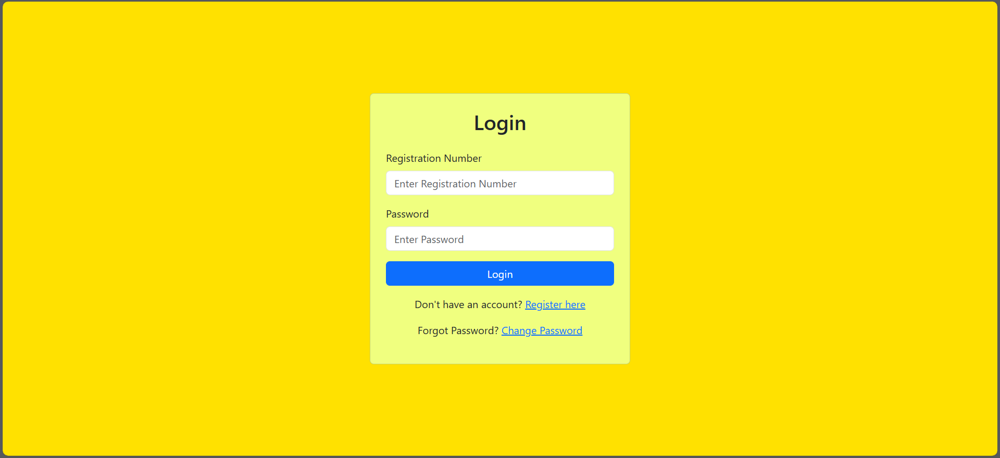
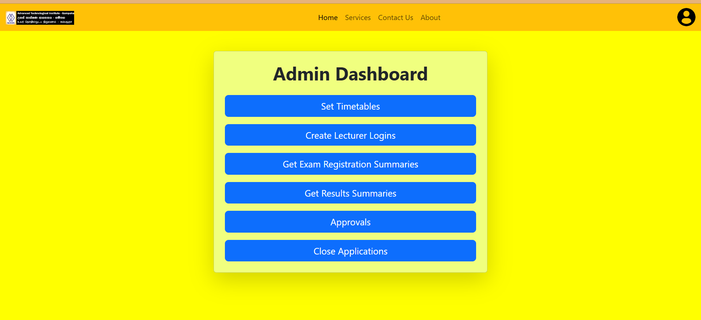
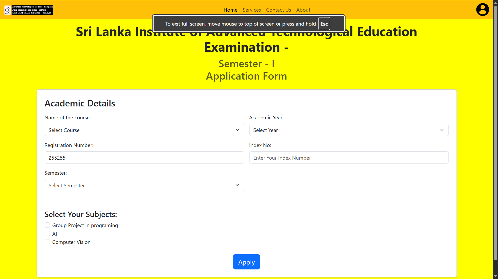
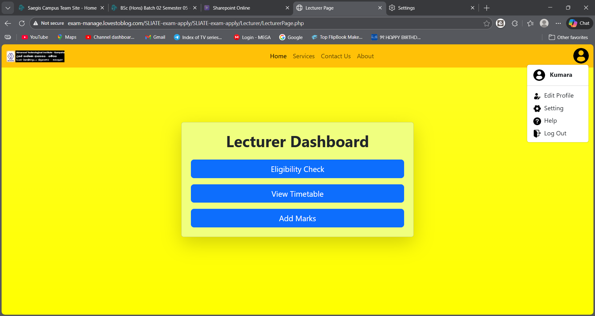

Here’s an upgraded **CV-level professional README.md** with badges + screenshots section 👇

---

# 🎓 Online Exam Apply & Management System


---

## 📌 Overview

The **Online Exam Apply & Management System** is a full-stack web application designed to **digitize and automate the exam application process** in educational institutions.

It supports multiple roles including **Students, Lecturers, Admin (Director), and Assistants**, ensuring structured workflow, transparency, and efficiency.

---

## 🚀 Key Features

### 👨‍🎓 Student Portal

* Online exam application system
* Profile management
* Secure authentication

### 👨‍🏫 Lecturer Dashboard

* Review student applications
* Mark eligibility for exams
* Manage subject-related data

### 👨‍💼 Admin Panel (Director)

* Full system control
* Monitor applications & approvals
* Manage users and roles

### 🧑‍💻 Assistant Panel

* Manage course modules
* Update academic years & batches

---

## 🔐 Security & Authentication

* Encrypted password storage
* Secure password reset via email
* Email notifications using PHPMailer

---

## 🛠️ Tech Stack

| Layer    | Technology            |
| -------- | --------------------- |
| Frontend | HTML, CSS, JavaScript |
| Backend  | PHP                   |
| Database | MySQL                 |
| DB Tool  | phpMyAdmin            |

---

## 🌐 Live Demo (Hosted on InfinityFree)

🔗 **Student Login**
[http://exam-manage.lovestoblog.com/SLIATE-exam-apply/SLIATE-exam-apply/Student/login.php](http://exam-manage.lovestoblog.com/SLIATE-exam-apply/SLIATE-exam-apply/Student/login.php)

🔗 **Admin Login**
[http://exam-manage.lovestoblog.com/SLIATE-exam-apply/SLIATE-exam-apply/Admin/admin_login.php](http://exam-manage.lovestoblog.com/SLIATE-exam-apply/SLIATE-exam-apply/Admin/admin_login.php)

🔗 **Lecturer Login**
[http://exam-manage.lovestoblog.com/SLIATE-exam-apply/SLIATE-exam-apply/Lecturer/Lecturer_login.php](http://exam-manage.lovestoblog.com/SLIATE-exam-apply/SLIATE-exam-apply/Lecturer/Lecturer_login.php)

🔗 **Assistant Panel**
[http://exam-manage.lovestoblog.com/SLIATE-exam-apply/SLIATE-exam-apply/Admin/Assistant/course_table.php](http://exam-manage.lovestoblog.com/SLIATE-exam-apply/SLIATE-exam-apply/Admin/Assistant/course_table.php)

---

## 🔑 Demo Credentials

```
Admin ID: 123654
Password: hi5##HI5
```

---


### 🖥️ Student Login



### 📊 Admin Dashboard



### 🧾 Exam Application Page



### 🧑‍🏫 Lecturer Panel



---

## 📂 Project Structure

```
SLIATE-exam-apply/
│
├── Admin/
├── Lecturer/
├── Student/
├── Database/
├── assets/
├── includes/
└── index.php
```

---

## ⚙️ Installation Guide

### 1️⃣ Clone Repository

```
git clone https://github.com/KUSHANcharuka/SLIATE-exam-apply.git
```

### 2️⃣ Move to Server

* XAMPP → `htdocs/`
* WAMP → `www/`

### 3️⃣ Setup Database

* Open phpMyAdmin
* Create a new database
* Import `.sql` file

### 4️⃣ Configure Connection

Update database credentials in:

```
connect.php
```

### 5️⃣ Run Project

```
http://localhost/SLIATE-exam-apply
```

---

## 📈 Learning Outcomes

* Full-stack web development (PHP + MySQL)
* Authentication & authorization systems
* Role-based system design
* Email integration
* Database management

---

## 🔮 Future Enhancements

* Responsive UI improvements
* REST API integration
* Role-based access refinement
* Cloud deployment (AWS / GCP)

---

## 🤝 Contributing

Contributions are welcome!
Feel free to fork this repository and submit pull requests.

---

## 📬 Contact

For feedback, suggestions, or collaboration:

* GitHub: [https://github.com/KUSHANcharuka](https://github.com/KUSHANcharuka)

---

## ⭐ Support

If you found this project helpful, please consider giving it a ⭐

---
